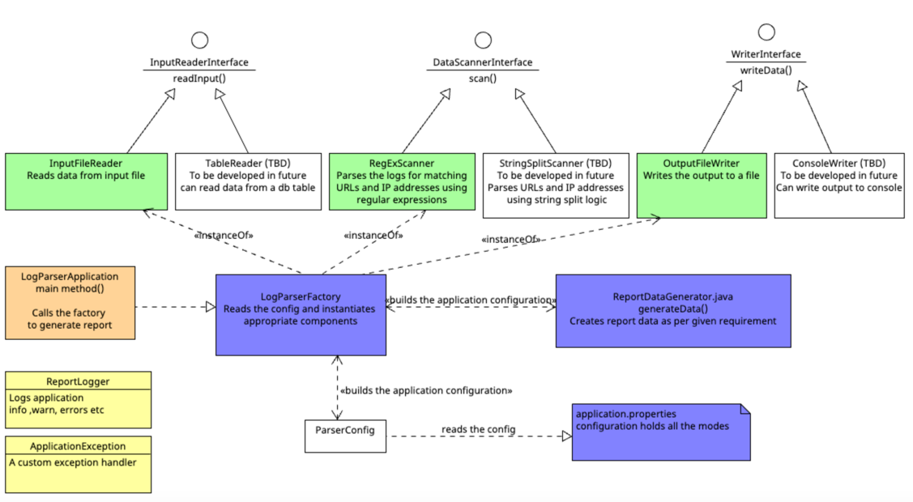
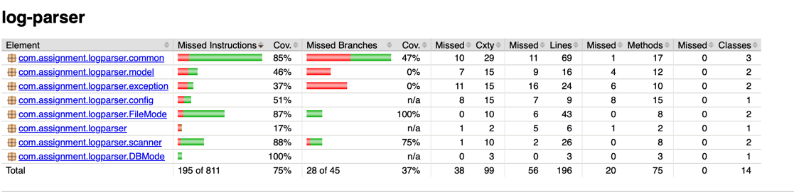
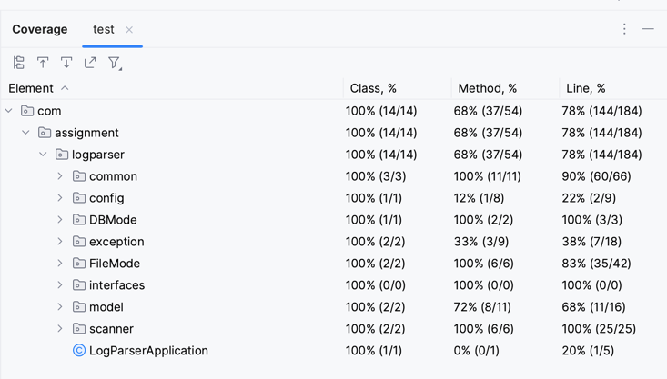
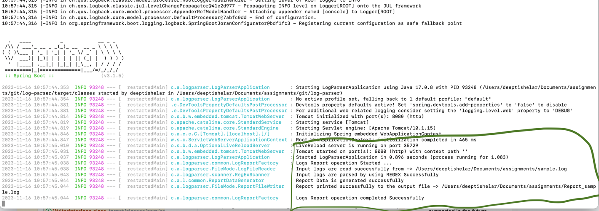

## From the desk of Deepti

This program is a spring based standalone application to generate reports from logs file.

**Technologies used:**
Java v17,
Spring v6,
Maven v3.9.4,
Spring Boot v3,
Junit v4,
Mockito (For mocking objects in Junits)
jacoco (for Test Reports)

**Design considerations:**

The design considers and adheres to **SOLID** principles in Java

1. **S: Single Responsibility** : Implemented interfaces for individual responsibility eg : **InputReaderInterface** for
   reading the input log file, **OutputWriterInterface** for writing output to the file
2. **O: Open/Closed relationship** : The program is open for extension but closed for modification. Used appropriate
   access modifiers and abstraction. Using **singleton** objects throughout the program.
3. **L: Liskov substitution** : Use of appropriate **interfaces** allows us to introduce new modes of input and output
   in
   future without disrupting the behavior of our program.
4. **I: Interface Segregation** : Ensuring that the interfaces are smaller and implementations are concerned about
   methods of their interest.
5. **D: Dependency Injection** : Using **Spring** and spring **Boot** which controls the responsibility of creating
   instances
   and maintaining the lifestyle

**Please note:**
_This program facilitates several modes of input, output and parsing. The program righ-now supports FILE mode and
RegularExpressions for parsing. However, the provision is made to support DBMode for input and output, different modes
of parsing like using SPLIT of Strings mechanism if the requirement need be. Use of appropriate configuration in
application.properties and interface implementations is highly recommended while supporting the future requirements._

**Design Diagram:**

**Test Coverage**

Below is the code coverage as per jacoco:

Below is the code coverage as per Intellij:

Assumptions:

1. The program reads one log file from given location and generates output file and places it at the same location. The
   file location and file names are to be configured in application properties file.
2. Currently, the program is configured as below in application.properties file.
   logparser.inputmode=FILE
   logparser.outputmode=FILE
   logparser.inputfilepath=src/main/resources/logs/
   logparser.inputfilename=sample.log
   logparser.outputpath=src/main/resources/logs/
   logparser.scanmode=REGEX
   logparser.topcount=3 (property states that the output data is top 3 (e.g: top 3 active IP addresses etc.))

This program works as follows for the above configuration:

1. The factory pattern reads the configuration and instantiates the appropriate classes to handle reading, parsing and
   generating reports
2. The input mode is FILE hence it reads the file from the configured location
3. The parsing or scanning mode is REGEX - regular expressions - meaning the logs are filtered based on the regular
   expressions
4. The output report is written to a file under given location prefix by Report
5. The logparser.topcount=3 property states that the output data is asked for top 3 (e.g: top 3 active IP addresses
   etc.)

**Steps to run the program on macOS:**

1. Clone the git repository : **<your_location>git clone https://github.com/deeptishelar/log-parser**
2. Get inside the project directory: **cd your_location/log-parser**
3. Place the log file under **your_location/log-parser/src/main/resources/logs** or any location of your choice
3. Ensure the application.properties file under **src/main/resources** is updated with appropriate fileName and path
3. Build the project : **your_location/log-parser>mvn clean install site -P test** (this step compiles the code, builds
   and executes the junit test cases)
4. The jacoco code coverage report can be found at : **your_location/log-parser/target/site/jacoco/index.html**
5. Start the spring boot app : **your_location/log-parser>mvn Spring-boot:run** the program execution logs are printed
   console as shown below.
6. The output report can be found at location specified in application.properties file for **logparser.outputpath**
   

**Best Practices followed:**

1. _**Flexibility**_ : No hard codings in the code. Extensive use of configuration makes it flexible.
   application.properties file offers place for all configurations. The modes can be changed in future without touching
   the actual code.
2. _**monitoring, troubleshooting, exception handling and debugging**_ : logging is enabled with excellent
   exception handling with custom and easy to understand error messages and appropriate details
6. _**clean and easy to understand**_ clean and meaningful naming conventions for classes and methods. Code supported
   with
   appropriate comments.
7. _**Robustness**_: comprehensive testing with more than 70% tests coverage including junit and integration.
10. _**Standard Code Quality**_: No code duplicates, no deprecated methods, well organized code, use of dependency
    injection.
11. _**self explaining naming conventions**_: class, method and field names are efficient in denoting the
    responsibilities.
12. _**Efficient use**_ of lambda expressions, lombok, jacoco, mocks, comparator utilities, junits to ensure high
    quality
    delivery.

**Design Patterns followed:**

1. Dependency Injection
2. Inversion Of Control
4. Singleton
5. Factory
5. External Configuration
6. Single Responsibility

**Known issues OR area of improvements**

1. Addition of PMD and checkstyle will help ensure code analysis.
2. Additional test cases to test logging levels
3. Implementation for other modes - command line input file name or console output or reading logs from db tables etc (
   these are kept as TBD considering the scope for this assignment)
4. Enhanced Report Generation : this program generates basic text file for the report. Enhancements can be added by
   subclassing the core class
5. UML diagram could have been more professional.
6. The current report is a plain text file, it can be enhanced to look pretty.

